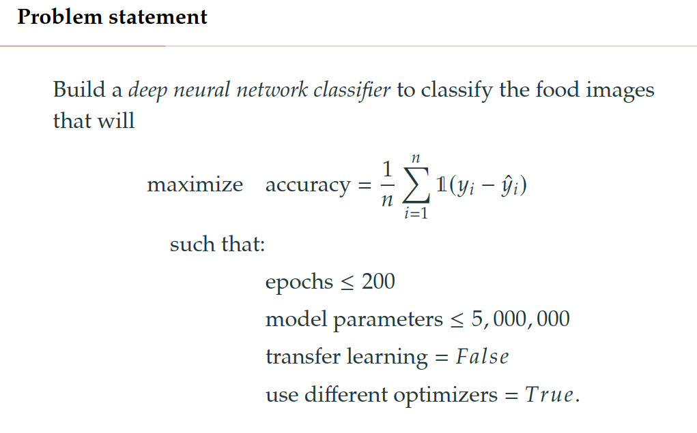

# non-convex-optimization-hackathon
This repository contains the codes for all the experiments perofrmed during the _Generative Modelling Hackathon Workshop_ under _Challenge 4: Implementing non-convex
optimization algorithms_.

# The dataset
The dataset used in this hackathon is the Food-101. Its properties are given below:

# Problem statement
Given limited resources (time, training epochs, model parameters), how do different optimization algorithms behave on the task of classifying the Food101 dataset, and in the presence of mislabelled/noisy training data? In summary, the problem and the constraints are given below:

# Goal 
To experiment with different optimization algorithms and validate their performance on classifying 101 foods correctly to have the highest possible accuracy. The model pipeline is set up using the following structure:

# Set up
All the experiments are run on the GPU and [comet](https://www.comet.com/site/) is used for tracking experiments. The following are the lists of options available to run with the entrypoint `run.py`:

# Team
The team that worked on this challenge comprises Rowan Turner, Galen Cao, Trung Pham, and Rasheed Ibraheem.

